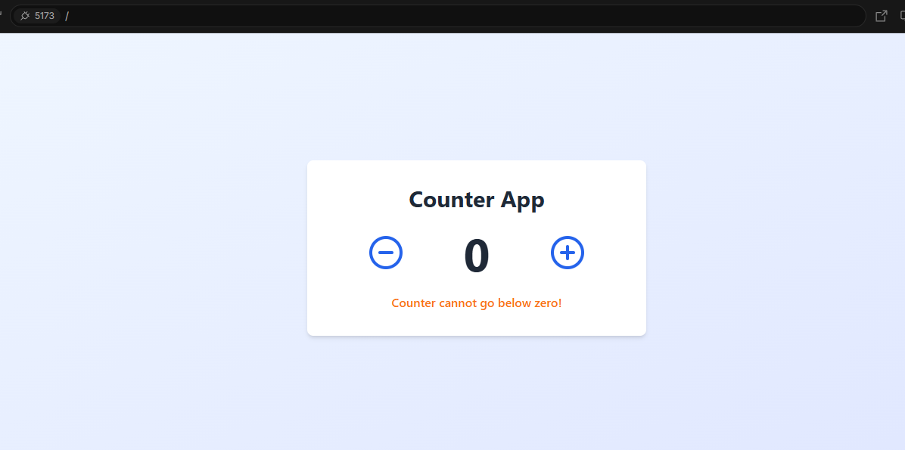

# React Counter App

A simple counter application built with React, TypeScript, and Tailwind CSS.



## Features

- Increment and decrement counter with intuitive buttons
- Visual feedback when attempting to go below zero
- Alert message when reaching the maximum threshold
- Clean, responsive design
- Subtle animations for better user experience

## Technologies Used

- React 18
- TypeScript
- Tailwind CSS
- Vite (for fast development and building)
- Lucide React (for icons)

## Installation

1. Clone the repository
   ```bash
   git clone https://github.com/yourusername/react-counter-app.git
   cd react-counter-app
   ```

2. Install dependencies
   ```bash
   npm install
   ```

3. Start the development server
   ```bash
   npm run dev
   ```

4. Build for production
   ```bash
   npm run build
   ```

## Usage

The Counter component accepts the following props:

- `initialValue` (optional): Sets the starting value of the counter (default: 0)
- `maxValue` (optional): Sets the threshold at which the limit message appears (default: 10)

Example:
```jsx
<Counter initialValue={5} maxValue={15} />
```

## Project Structure

```
/src
  /components
    Counter.tsx       # Main counter component
  App.tsx             # App component that renders the Counter
  main.tsx            # Entry point
  index.css           # Global styles
```

## License

MIT

## Contributing

Contributions are welcome! Please feel free to submit a Pull Request.
